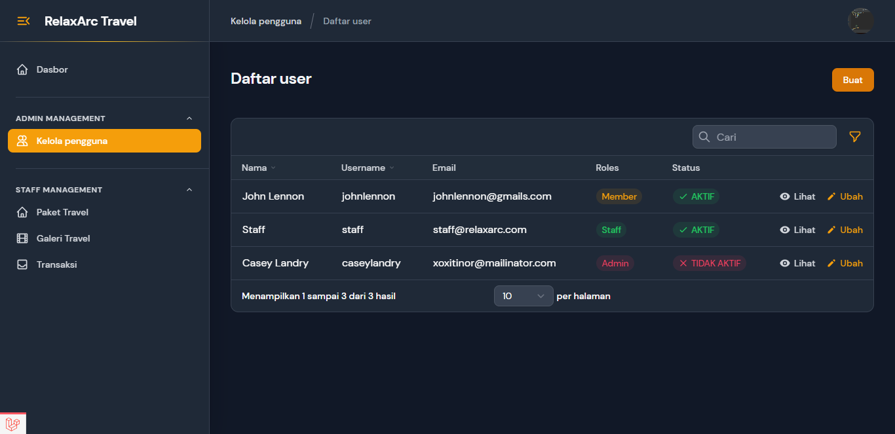

<!-- <p align="center">
  
</p>

# Laravel Travel App Platform

This is a travel app platform I made mostly using Laravel ^8.12 -->

<h1 align="center">
RelaxArc Travel
</h1>

<h5 align="center">
Laravel Travel App Platform.
</h5>

<p align="center">
    <a href="https://github.com/muhammadhabibfery/relaxarc-travel/actions/workflows/test.yml">
    
    <a href="https://www.php.net">
        
    </a>
    <a href="https://laravel.com">
        
    </a>
</p>

</br>

| [Features][] | [Requirements][] | [Install][] | [How to setting][] | [DB Structure][] | [License][] |

## Features 
- 
- |<h3>Menu  </h3>       |       Description                                                                  |
  |-----------------------|-----------------------------------------------------------------------------------|
  |<b>Dashboard           | </b>Contains information about all menu.                                          |
  |<b>User Management     | </b>Manage members and employees.                                                 |
  |<b>Travel Package      | </b>Manage all types of travel packages.                                          |
  |<b>Travel Gallery      | </b>Manage images for each type of travel package.                                |
  |<b>Transaction         | </b>Manage transaction for each type of travel package.                           |
  |<b>Profile             | </b>Edit user's profile and password.                                             |
- Travel Platform Solution
- Open Source

## Requirements

	PHP = ^7.3|^8.0
    laravel = ^8.12
    laravel-ui = ^3.2
    filament/filament = ^2.0
    intervention/image = ^2.5
    midtrans/midtrans-php = ^2.5
    barryvdh/laravel-debugbar: ^3.5

## Install

Clone repo

```
git clone https://github.com/muhammadhabibfery/relaxarc-travel.git
```

Install Composer


[Download Composer](https://getcomposer.org/download/)


composer update/install 

```
composer install
```

Install Nodejs


[Download Node.js](https://nodejs.org/en/download/)


NPM dependencies
```
npm install
```

Using Laravel Mix 

```
npm run dev
```

## How to setting 

Go into .env file change Database and Email credentials.
Then setup the midtrans (Payment Gateway) with your credentials
```
MIDTRANS_SERVER_KEY = <Your-Server-Key>
MIDTRANS_PRODUCTION = false
MIDTRANS_SANITIZED = true
MIDTRANS_3DS = true|false
```

Run the migration

```
php artisan migrate
```

Or run the migration with seeder if you want seeding the related data

```
php artisan migrate --seed
```

Generate a New Application Key

```
php artisan key:generate
```

Create a symbolic link

```
php artisan storage:link
```

## Database Structure


## License

> Copyright (C) 2022 Muhammad Habib Fery.  
**[⬆ back to top](#laravel-travel-app-platform)**

[Features]:#features
[Requirements]:#requirements
[Install]:#install
[How to setting]:#how-to-setting
[DB Structure]:#database-structure
[License]:#license
